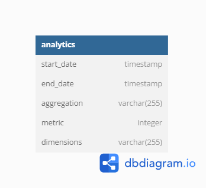

# Data Engineering Hackathon

### Tools used:

* **Data Source**: Google BigQuery
* **Data Processing Layer**: Azure Databricks, Apache Airflow
* **Time Series Output**: PostgreSQL Database
* **Deploy**: Docker for Airflow and Render for Postgres


Sample configuration:
```json
{
    "source": {
        "start_date": "25/07/2017",
        "end_date": "30/07/2017"
    },
    "granularity": "daily",
    "kpis": [
        {
            "name": "Users count",
            "sql": "approx_count_distinct(fullVisitorId, 0.03)"
        },
        {
            "name": "Bounce count",
            "sql": "sum(totals.bounces)"
        },
        {
            "name": "Conversion rate",
            "sql": "(sum(totals.transactions)/count(*))*100"
        }
    ],
    "dimensions": [
        "geoNetwork.country",
        "device.browser",
        "device.deviceCategory",
        "device.operatingSystem"
    ],
    "depth": 2
}
```

The Databricks connector is utilized to pass the configuration and data source details in the Airflow DAG to run the job on the Databricks cluster.


## Checkpoint 1: Data Aggregation and Transformation

**dataset:** <a href="https://console.cloud.google.com/marketplace/product/obfuscated-ga360-data/obfuscated-ga360-data?project=lexical-script-761" target="_blank">bigquery-public-data.google_analytics_sample</a>

**Azure Databricks Workspace:** https://adb-6168097710450920.0.azuredatabricks.net/

* **BigQuery Storage API** is used to read the BigQuery table into the spark notebook. 

* Aggregate values and Dimension Cuts are calculated using **pyspark sql functions**.

* The notebook is deployed on **Azure Databricks**. 

## Checkpoint 2: Airflow Pipeline

* **Docker** is used to deploy Airflow.

* The **Databricks connector** is installed on Docker using Dockerfile and docker-compose files.

* **databricks_dag.py** is a DAG created to trigger the databricks notebook job.

```console
$ cd <working_dir>
$ docker-compose up -d --build

---> 100%
```

* The transformed data is updated into the postgres database.



* The pipeline is scheduled to run at specified intervals

#### Configure Databricks connection

* Airflow connects to Databricks using a Databricks personal access token (PAT).

* The airflow configuration looks like
```json
{
    "conn_id": "databricks_default",
    "host": "https://adb-6168097710450920.0.azuredatabricks.net/",
    "extra_params": {
        "token": "PERSONAL_ACCESS_TOKEN"
    }
}
```

## Checkpoint 3: Multi Granularity Support

* The system is flexibe in performing data aggregation and transformations at various granularities. 

* Time intervals:
```daily``` 
```weekly``` 
```monthly``` 
```quarterly``` 
```yearly```


